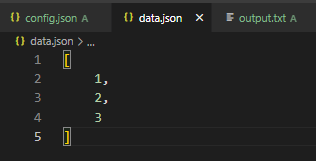

# Задание 3. Доработайте программу.

Модифицируйте программу из задания 2 таким образом, чтобы она могла:

1. Читать данные не только из файла, но и из стандартного ввода.
2. Принимать через аргументы командной строки параметр для определения источника данных (файл или stdin).
3. Сохранять результат работы в указанный пользователем файл, а не только в стандартный вывод.
4. Поддерживать конфигурацию через файл настроек или переменные окружения (например, URL для HTTP запроса).
5. Результаты заданий следует представить в текстовом виде (не в виде ссылок).

# Решение

Запуск с существующим файлом с массивом цифр

`go run cmd/task3/main.go --config=config.json --file=data.json --log=logs/ --output=output.txt`

Запуск со стандартным вводом

`go run cmd/task3/main.go --config=config.json --stdin=[1,2,3] --log=logs/ --output=output.txt`

###### Файл с логами:

###### Как хранятся лог-файлы

###### Файл конфига приложения

###### Входной файл с массивом

###### Файл вывода

